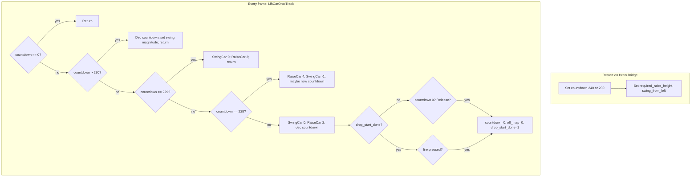

# Draw Bridge Lift (Crane) Animation – Implementation Plan

## Context

The original Amiga game uses a **lift** that raises the car from the pit and swings it onto the draw-bridge track; the port has this **stubbed** ([Car_Behaviour.cpp](src/Car_Behaviour.cpp) line 2161: `LiftCarOntoTrack(void) { return; }`). The assembly reference is [reference/StuntCarRacer.s](reference/StuntCarRacer.s) (~27k lines, 68000). The **draw-bridge geometry** animation already exists in the port ([Track.cpp](src/Track.cpp): `MoveDrawBridge`, `ResetDrawBridge`); only the **car-on-chains** behaviour is missing.

## Assembly reference mapping

| Assembly (StuntCarRacer.s)            | Role                                                                                                                                          |
| ------------------------------------- | --------------------------------------------------------------------------------------------------------------------------------------------- |
| `lift.car.onto.track` (7869–7986)     | Main entry: branches on `car.on.chains.countdown` (230, 229, 228), calls `swing.car` / `raise.car.off.ground`, handles drop start and release |
| `swing.car` (8012–8045)               | Applies swing: magnitude ±16, REDUCTION (238), sets `players.z.angle` from `swing.magnitude` and `players.x.offset.from.road.centre`          |
| `raise.car.off.ground` (7988–8009)    | Lifts car: compares `players.smaller.y` to `required.raise.height`, adjusts `car.collision.y.acceleration` (adds upward impulse, clamped)     |
| `car.on.chains.countdown`             | Byte countdown while on chains; 0 = not on chains                                                                                             |
| `swing.from.left` / `swing.magnitude` | Swing direction (bit7 set = from left) and amount (target ±16)                                                                                |
| `drop.start.done`                     | Bit7 set when car has been released from chains (drop start done)                                                                             |
| `required.raise.height`               | Set at restart from road height (sprp5: `rear.road.height` >> 2)                                                                              |

Countdown is **initialised** at race/restart in `set.players.restart.position` (13701: 240, then 13773: 230 for drop start; 13775: `required.raise.height` from rear road height). When the car goes **off map** at the draw-bridge pit, `off.map.status` is set and `swing.from.left` is set from `players.x.offset.from.road.centre` (13478). `lift.car.onto.track` is called every frame from the same place the port calls `LiftCarOntoTrack()` (asm 16259, port 1943).

## Port state today

- [Car_Behaviour.cpp](src/Car_Behaviour.cpp): `on_chains` exists but is hard-wired to FALSE (179, 360); `player_z_angle` and `car_collision_y_acceleration` exist; `LiftCarOntoTrack()` is a no-op (2161). Collision/grounded logic already skips or adapts when `on_chains` is true (724, 737, 1921).
- [Track.cpp](src/Track.cpp): `MoveDrawBridge()` / `ResetDrawBridge()` already animate the bridge; no lift state.
- Restart positioning is in `PositionCarAbovePiece` / `set.players.restart.position`; there is no draw-bridge–specific initialisation of a countdown or lift state.

## Implementation steps

### 1. Add lift state variables (Car_Behaviour.cpp)

- Add static (or module-level) variables mirroring the assembly:
  - `car_on_chains_countdown` (int or char, 0 = not on chains).
  - `swing_from_left` (int/char: 0 = right, non-zero = left; match assembly bit7 convention if convenient).
  - `swing_magnitude` (int, target ±16).
  - `required_raise_height` (long, world-Y scale to match port).
  - `drop_start_done` (int/char, 0 = not yet released; non-zero = released).
- Keep using existing `on_chains` as the “car is on chains” flag: set it true when `car_on_chains_countdown > 0`, false when 0.

### 2. Initialise lift state at restart (Draw Bridge only)

- In the restart path that calls `PositionCarAbovePiece` (or equivalent), when `TrackID == DRAW_BRIDGE` (see [Track.h](src/Track.h) `DRAW_BRIDGE`):
  - Set `car_on_chains_countdown = 240` (or 230 if you implement “drop start” vs “press fire” from the outset).
  - Set `required_raise_height` from the same road height used for positioning (equivalent of `rear.road.height >> 2` in the port’s units).
  - Set `swing_from_left` when the car is placed to the side (e.g. from player’s x offset from road centre at restart, matching asm 13478).
  - Initialise `swing_magnitude` to 0 (or per asm 7882–7885: 44 or 256-44 depending on `swing_from.left`).
  - Set `drop_start_done = 0` for a new race/restart.
- Ensure `on_chains = (car_on_chains_countdown > 0)` after this so the rest of the code sees “on chains” correctly.

### 3. Implement LiftCarOntoTrack() (Car_Behaviour.cpp)

Port the control flow of `lift.car.onto.track` (asm 7869–7986) and the subroutines it calls:

- **Early exit:** If `car_on_chains_countdown == 0`, return (car not on chains).
- **Countdown > 230:** Decrement countdown; optionally set initial swing magnitude (44 or -44 from `swing_from_left`); return.
- **Countdown == 229 (lift.car.stage1):** Call `SwingCar(0)` (no adjustment). Call `RaiseCarOffGround(3)`. If raise says “done”, decrement countdown and return.
- **Countdown == 228 (lift.car.stage2):** Call `RaiseCarOffGround(4)`. Call `SwingCar(-1)` to reduce swing. If magnitude reaches minimum, set new countdown (random 160–191 or 140 for “press fire”), set “prompt required”, return; else return.
- **Countdown == 227 or less (lift.car.stage3):** Call `SwingCar(0)`. Call `RaiseCarOffGround(2)`. If “fourteen.frames.elapsed” (or equivalent), decrement countdown; if countdown hits 0, add 1 (hold at 1 until release). If `drop_start_done` set, branch to “subsequent.lift”; else if countdown > 0, return.
- **Release (subsequent.lift / car.off.chains):** If “boost/fire” pressed (or countdown 0), set `car_on_chains_countdown = 0`, `off_map_status = 0`, clear prompt, set `drop_start_done` (e.g. 0x80); else return.

Use the **exact numeric constants** from the assembly (230, 229, 228, 44, 16, REDUCTION 238, raise amounts 2/3/4, etc.) so behaviour matches the original.

### 4. Implement SwingCar(adjustment) (Car_Behaviour.cpp)

Port `swing.car` (8012–8045):

- Target magnitude: +16 or -16 depending on `swing_from_left` (positive = from right).
- Apply `adjustment` to `swing_magnitude` (signed), scaled by REDUCTION (238) as in asm (e.g. `adjustment * 256` then multiply by 238, shift).
- Clamp `swing_magnitude` to the target ±16.
- Set **player_z_angle** from swing: `player_z_angle = (swing_magnitude - (players_x_offset_from_road_centre << 5))` (or equivalent in port units); use the same scaling as the rest of the game for angles (e.g. MAX_ANGLE / 256).
- Set `overall_difference_below_road = 0` while on chains (asm 8040–8041).
- Return whether magnitude reached target (for stage logic).

You already have `player_z_angle` and the road-offset concept; match the port’s existing angle and offset variables (e.g. from collision/road position code).

### 5. Implement RaiseCarOffGround(amount) (Car_Behaviour.cpp)

Port `raise.car.off.ground` (7988–8009):

- Compute “current height” equivalent to `players.smaller.y` (port likely has a scaled player y or “amount below road”; use the same as collision code).
- Compare to `required_raise_height`; difference `d3 = current - required`.
- Subtract `(amount << 8)` from `d3` (amount = 2, 3, or 4).
- Compute delta: `d0 = d3 >> 3; d0 -= 256`; clamp to [-512, 0].
- **Subtract** `d0` from `car_collision_y_acceleration` (adds upward impulse).
- Return “done” when the car has reached the target height (or when the adjusted acceleration would have finished the move), so the countdown can advance.

Expose or use the same `car_collision_y_acceleration` and height variables the rest of [Car_Behaviour.cpp](src/Car_Behaviour.cpp) uses so integration is consistent.

### 6. Trigger swing.from_left when entering the pit (Draw Bridge)

When the car goes off the map at the draw-bridge pit (e.g. `off_map_status` set and track is Draw Bridge), set `swing_from_left` from the player’s x offset from road centre (same as asm 13478). The port already has `off_map_status` and road-offset logic; add this one-off assignment where the port detects “just went off map” on Draw Bridge so the swing direction matches which side the car came from.

### 7. Optional: “Press fire to drop” and prompts

- The assembly uses “press fire” to release from chains and sets “prompt required” (e.g. 60, “press fire”). If the port has a prompt/message system, hook the release condition (countdown 0 or fire pressed) to show the same prompt and set `drop_start_done` when the player releases.
- If you defer drop-start logic, you can still implement the lift and swing and release when countdown reaches 0 without a fire check, then add the fire check later.

### 8. Replay / save state (optional)

The port comment at 508 says “replay doesn’t currently work on DrawBridge - doesn’t know starting DrawBridge frame”. If replay or save state is required, persist and restore `car_on_chains_countdown`, `swing_magnitude`, `swing_from_left`, `required_raise_height`, and `drop_start_done` for Draw Bridge so the lift state can be restored.

## Files to change

- **[Car_Behaviour.cpp](src/Car_Behaviour.cpp):** Add state variables; implement `LiftCarOntoTrack()`, `SwingCar()`, `RaiseCarOffGround()`; set `on_chains` from countdown; in restart path (or wherever Draw Bridge start is set), initialise countdown and `required_raise_height` when `TrackID == DRAW_BRIDGE`; when going off map on Draw Bridge, set `swing_from_left` from road offset.
- **[Car_Behaviour.cpp](src/Car_Behaviour.cpp)** (or [StuntCarRacer.cpp](src/StuntCarRacer.cpp) if restart lives there): In the restart/positioning path that uses `PositionCarAbovePiece`, add Draw Bridge–specific initialisation of lift state (countdown 240/230, `required_raise_height`, `swing_from_left`, `drop_start_done`).
- Optionally **[Track.cpp](src/Track.cpp)** or wherever “off map” is set for Draw Bridge: one-time set of `swing_from_left` from player’s x offset from road centre.

## Testing

- Load Draw Bridge track; start race. Car should be raised and swung onto the track (countdown 240 → 229 → 228 → …) and then released (countdown 0, `on_chains` false).
- Compare with Amiga: swing direction, height of raise, and timing (countdown values and frame-based logic) should feel the same; use the same constants as the assembly.
- Test restart on Draw Bridge: lift state should re-initialise (countdown 240/230, swing from correct side).

## Diagram (lift state machine)

This plan uses only the assembly reference and existing port structure; no new assets or engine changes are required beyond the listed files and state variables.
